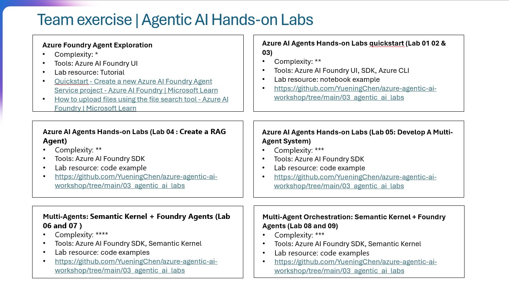

# Backbase AI Workshop – README

**Dates:** July 22–23, 2025  
**Audience:** Technical and business professionals

## Workshop Focus

- Fundamentals of Generative AI and RAG (Retrieval Augmented Generation)
- Agentic AI: building, orchestrating, and deploying AI agents
- Microsoft Azure AI ecosystem: Foundry, OpenAI, Semantic Kernel, Copilot Studio
- Responsible AI, security, and operationalization

## Agenda Highlights

### Day 1

- Generative AI basics & use cases
- RAG architecture & search technologies
- Hands-on labs

### Day 2

- Agentic workflows & Azure AI Agent Service
- LLM orchestration with Semantic Kernel
- Productionizing LLMs
- Hands-on labs & wrap-up

## Key Takeaways

- AI is transforming business processes, customer engagement, and innovation
- Agentic AI enables autonomous, adaptable workflows
- Azure AI provides secure, scalable tools for building and deploying AI solutions
- Responsible AI and data privacy are core to all solutions

## Hands-On Labs

### [Agentic AI Labs PDF link](./agentic_ai_labs.pdf)
