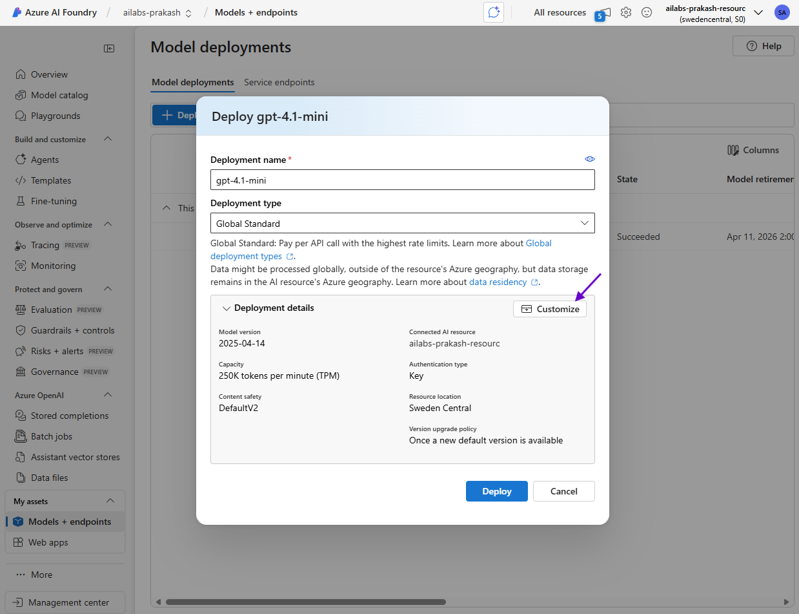

# Lab 0 - Lab Setup

In this lab, you will set up the environment for the Azure Agentic AI workshop.

## Step 1: Create a Resource Group

1. Go to the [Azure Portal](https://portal.azure.com/).
2. Click on "Resource groups" under **Navigate**.
    
3. Click on **+ Create** to create a new resource group.
4. Fill in the required details:
   - Subscription: Select the Azure subscription assigned to you.
   - Resource group name: Enter a unique name for your resource group. Preferably use a name that is identifiable to you, such as your name or initials. (e.g. `<yourname>-Lab-RG`)
   - Region: For the region choose **(Europe) Sweden Central**.
   
5. Click **Review + create** and then **Create** to provision the resource group.

## Step 2: Set up Azure AI Foundry Project

1. Go to the [Azure AI Foundry Model Catalog](https://ai.azure.com/explore/models).
2. Find the model named **gpt-4.1** and click that.
    
3. It will open the model details page. Click on **Use this model**.
    
4. In the **Create a project** page, expand Advanced options and fill in the required details:
   - Project name: Enter a unique name for your project (e.g., `ailabs-<yourname>`).
   - Select your Azure subscription.
   - Resource group: Select the resource group you created earlier.
   - Region: Choose **(Europe) Sweden Central**.
   - Click **Create** to create the project. This will take a few minutes. This will create an Azure AI Foundry project with the GPT-4.1 model deployed.
   

## Step 3: Create Azure OpenAI model deployments

1. In the Azure AI Foundry project, click on **Models + endpoints** in the left-hand menu under My assets section.
    
2. Click on **+ Deploy model** and choose **Deploy base model**.
3. In the "Select a model" page, search for **gpt-4.1-mini**, select it and choose **Confirm.
    
4. In the **Deploy gpt-4.1-mini** page, click on **Customize**.
    
5. Fill in the required details:
   - Deployment name: Leave it as `gpt-4.1-mini`.
   - Deployment type: Choose **Global Standard**.
   - Connected AI resource: Make sure it's the Azure AI Foundry project you created earlier.
   - Tokens per Minute Rate Limit: Set it to **250K** (if the default value is already 250K leave it as is).
   - Click **Deploy** to deploy the model.
   
6. Once the model is deployed, it will open the details page. Click the back button to return to the Models + endpoints page.
7. Repeat steps 2-6 to deploy the **text-embedding-ada-002** model as well. Make sure to set the deployment name to `text-embedding-ada-002` and the tokens per minute rate limit to **150K**.
    

We have now set up the Azure AI Foundry project and deployed the necessary models. You are ready to proceed with the labs in this workshop.