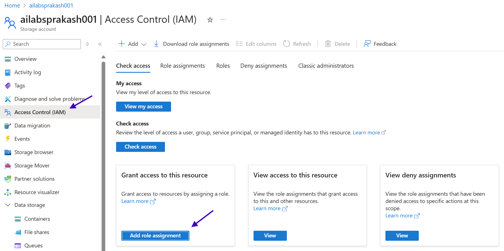

# Lab 1 - Standard RAG

In this lab, we will implement a standard Retrieval-Augmented Generation (RAG) system using a simple dataset. The goal is to use the built-in Vectorization capabilities of Azure AI Search to vectorize our data and then use it to answer questions.

## Step 1: Create a Resource Group

1. Go to the [Azure Portal](https://portal.azure.com/).
2. Click on "Resource groups" under **Navigate**.
    
3. Click on **+ Create** to create a new resource group.
4. Fill in the required details:
   - Subscription: Select the Azure subscription assigned to you.
   - Resource group name: Enter a unique name for your resource group. Preferably use a name that is identifiable to you, such as your name or initials. (e.g. `<yourname>-Lab-RG`)
   - Region: For the region choose **(Europe) Sweden Central**.
   
5. Click **Review + create** and then **Create** to provision the resource group.

## Step 2: Set Up Azure Storage Account

1. Click Home in the Azure Portal to return to the main dashboard.
2. Click on "Create a resource" and select "Storage account".
    
3. Fill in the required details:
   - Subscription: Select the Azure subscription assigned to you.
   - Resource group: Select the resource group you created earlier.
   - Storage account name: Enter a unique name for your storage account. (E.g. `ailabs<yourname>001`)
   - Region: For the region choose **(Europe) Sweden Central**.
   - Performance: Choose **Standard**.
   - Redundancy: Choose **Locally-redundant storage (LRS)**.
   
4. Click **Review + create** and then **Create** to provision the storage account.

### Step 2.1: Create a Container in the Storage Account

1. Navigate to the storage account you just created.
2. In the left-hand menu, click on **Containers** under the **Data storage** section.
3. Click on **+ Container** to create a new container
4. Fill in the required details:
   - Name: Enter a name for your container (e.g., `standard-rag-data`).
   - Public access level: Choose **Private (no anonymous access)**.
5. Click **Create** to create the container.
   

### Step 2.2: Upload Data to the Container

1. Download the sample data file [bdo-unibank-2024-annual-report.pdf](examples/bdo-unibank-2024-annual-report.pdf) to your local machine.
2. In the Azure Portal, navigate to the storage account you created.
3. Click on the container you just created (e.g., `standard-rag-data`).
4. Click on **Upload** to upload files to the container.
5. Click on **Browse for files** and select the `bdo-unibank-2024-annual-report.pdf` file you downloaded.
6. Click **Upload** to upload the file to the container.
   

### Step 2.3: Set Up Managed Identity access to Azure Storage Account for Azure AI Search

1. Navigate to the Storage account you created.
2. In the left-hand menu, click on **Access Control (IAM)**.
3. Click on **Add role assignment** under Grant access to this resource.
    
4. In the **Role** dropdown, search for **Storage Blob Data Contributor**, choose that role and click **Next**.
    
5. In the Members tab, under **Assign access to**, select **Managed identity**. And click on **Select members**.
6. In the **Select** field, search for and select the Azure AI Search resource that has been assigned to you.
    
7. Click **Review + assign** to review the role assignment and click **Review + assign** to apply the changes.

## Step 3: Create Search Index in Azure AI Search

1. Click Home in the Azure Portal to return to the main dashboard.
2. Enter "Azure AI Search" in the search bar and select it from the results.
    
3. Navigate to the Azure AI Search resource that has been assigned to you.
4. On the top menu, choose **Import and vectorize data**.
5. Choose **Azure Blob Storage** as the data source.
6. Choose **RAG** as the scenario.
7. Under **Connect to your data**:
    - Choose your subscription
    - Choose your storage account
    - Choose the container that you created earlier.
    - Choose the check box for **Enable deletion tracking**, and leave the default "Native blob soft delete" option selected.
    - Choose the check box for **Authenticate using Managed Identity** and choose the **Managed Identity** from the dropdown. Then click **Next**.
    
8. Under **Vectorize your text**:
    - Choose **AI Foundry Hub catalog models** for Kind.
    - Choose the subscription.
    - Choose the **AI Foundry Project** that has been assigned to you.
    - Choose the **Model deployment** as `text-embedding-ada-002`.
    - Choose **API Key** as the authentication type.
    - Acknowledge the cost for using the AI Foundry Project and click **Next**.
    
9. Don't enable *Vectorize your images* and *Enrich your data with AI skills* and click **Next**.
10. Under **Advanced settings**:
    - Choose the **Enable semantic ranker** under *Advanced ranking and relevancy*.
    - For the *Schedule indexing* choose **5 minutes** under Schedule dropdown.
    - Click on **Next**.
    
11. Under **Review and create**:
    - For the *Objects name prefix* enter `<yourname>-standard-rag`.
    - Review the settings you have configured.
    - Click on **Create** to create the search index and indexer.
    
12. Once the index and indexer are created, you will see a notification saying "Start searching".
13. It will take you to the **Search explorer** page where you can test your search index by clicking on the **Search** button.
    

## Step 4: Chat with your data on Chat Playground

1. Navigate to [Azure AI Foundry](https://ai.azure.com/).
2. If you are visiting for the first time, choose the right project from the list of resources.
    
3. Click on **Playgrounds** in the left-hand menu and choose **Chat Playground**.
    
4. In the Chat Playground, for **Deployment**, select the `gpt-4.1` deployment.
5. In the **Select or add data source** blade:
    - Choose **Azure AI Search** in the "Select data source" dropdown.
    - Click your sub subscription and select the Azure AI Search resource you created.
    - Choose the Azure AI Search index you created earlier (e.g., `<yourname>-standard-rag-index`).
    - Choose the check box for **Add vector search to this search resource**.
    - Choose **Azure OpenAI - text-embedding-ada-002** from the dropdown for embedding model.
    - Without changing any other settings, click **Next**.
6. In the **Data management** blade:
    - Choose **Hybrid + semantic** in the "Search type" dropdown.
    - Choose `<yourname>-standard-rag-semantic-configuration` in the "Select an existing semantic search configuration" dropdown.
    - Click **Next**.
7. In the **Data Connection** blade, choose **API Key** as the authentication type and click **Next**.
8. In the **Review and Finish** blade, review the settings and click **Save and close**.
9. Once the data source is added it will appear in the **Add your data** section.
    
10. Expand the **Parameters** section and set the **Temperature** to `0`.
    
11. In the **Chat Playground**, you can now ask questions related to the data you uploaded. For example, you can ask:
    - What are the key highlights from the annual report?
    - What is their approach on sustainability?
    
12. Update the system prompt (text box under **Give the model instructions and context**, you need to **Apply changes** for it to take effect) to review how the model responds to different instructions. For example, you can change the system prompt to:
    - You are a financial analyst that helps Gen Z find information. Hence make your response appealing for them and add appropriate emojis. Make sure the response is not more than 100 words.
    
13. You can try different parameters or system prompts to see how the model responds. You can also explore the **Citations** section to see the sources of information used by the model to answer your questions.
14. This completes the lab. You have successfully implemented a standard RAG system using Azure AI Search and Azure AI Foundry.

## Summary

In this lab, you learned how to set up a standard Retrieval-Augmented Generation (RAG) system using Azure AI Search and Azure AI Foundry. You created a resource group, set up an Azure Storage account, uploaded data, created a search index, and finally interacted with the data using the Chat Playground. You also learned how to customize the model's behavior using system prompts and parameters.
