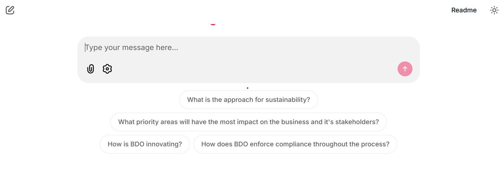

# Lab 2 - Image Processing RAG

In this lab, we will implement a Retrieval-Augmented Generation (RAG) system that focuses on both text and image processing. The goal is to use Azure AI Search to vectorize image data and then use it to answer questions related to the images.


## Step 1: Create a Python Function App

1. Go to the [Azure Portal](https://portal.azure.com/).
2. Click on "Create a resource" and select "Function App".
    
3. In the "Select a hosting option" section, choose **Flex Consumption** and click **Select**.
    
4. Fill in the required details in *Basics* section of the Function App creation form:
   - Subscription: Select the Azure subscription assigned to you.
   - Resource group: Select the resource group you created in Lab 1.
   - Function App name: Enter a unique name for your Function App (e.g., `aifunc<yourname>`). Ensure **Secure unique default hostname (preview) on** is enabled.
   - Region: For the region, choose **(Europe) Sweden Central**.
   - Runtime stack: Choose **Python**.
   - Version: Choose **3.12**.
   - Instance Size: Choose **2048 MB**.
   - For Zone redundancy, choose **Disabled** and click **Next: Storage >**.
    
5. In the *Storage* section, for Storage account, select the storage account you created in Lab 1.
    
6. Click **Review + create**.
7. Review the settings and click **Create** to provision the Function App.
8. Wait for the deployment to complete, then click **Go to resource** to navigate to your Function App.
    
9. In the Function App overview, expand **Settings**, choose **Identity** in the left-hand menu. Under the **System assigned** tab, toggle the **Status** to **On** and click **Save**. When it asks for confirmation, click **Yes**.
    

## Step 2: Setup Permissions for the Function App

### Step 2.1: Set Up Managed Identity access to Azure Storage Account for Azure Function App

1. Navigate to the Storage account you created in Lab 1.
2. In the left-hand menu, click on **Access Control (IAM)**.
3. Click on **Add role assignment** under Grant access to this resource.
    
4. In the **Role** dropdown, search for **Storage Blob Data Contributor**, choose that role and click **Next**.
    
5. In the Members tab, under **Assign access to**, select **Managed identity**. And click on **Select members**.
6. In the **Select** field, search for and select the Function App resource that you created earlier in Step 1.
    
7. Click **Review + assign** to review the role assignment and click **Review + assign** to apply the changes.
8. Wait for the role assignment to complete.

### Step 2.2: Set Up Managed Identity access to Azure AI Services for Azure Function App

1. Navigate to the [Azure AI Foundry](https://ai.azure.com/) and click **Management Center** at the bottom of the left navigation pane.
    
2. In the AI Foundry Management Center overview, click on **View access control (IAM)** link which will take you to the IAM section of the AI Foundry resource in the Azure Portal.
    
3. Click on **Add role assignment** under Grant access to this resource.
    
4. In the **Role** dropdown, search for **Cognitive Services Data Contributor**, choose that role and click **Next**.
    
5. In the Members tab, under **Assign access to**, select **Managed identity**. And click on **Select members**.
6. In the **Select** field, search for and select the Function App resource that you created earlier in Step 1.
    
7. Click **Review + assign** to review the role assignment and click **Review + assign** to apply the changes.
8. Wait for the role assignment to complete. and then again, Click on **Add role assignment** under Grant access to this resource.
    
9. In the **Role** dropdown, search for **Cognitive Services OpenAI Contributor**, choose that role and click **Next**.
    
10. In the Members tab, under **Assign access to**, select **Managed identity**. And click on **Select members**.
11. In the **Select** field, search for and select the Function App resource that you created earlier in Step 1.
    
12. Click **Review + assign** to review the role assignment and click **Review + assign** to apply the changes.

## Step 3: Create containers in storage account

1. Navigate to the [storage account](https://portal.azure.com/#view/Microsoft_Azure_StorageHub/StorageHub.MenuView/~/StorageAccountsBrowse) you created in Lab 1.
2. In the left-hand menu, click on **Containers** under the **Data storage** section.
3. Click on **+ Add Container** to create a new container.
4. Fill in the required details:
   - Name: Enter a name for your container (e.g., `advanced-rag-data`).
   - Public access level: Choose **Private (no anonymous access)**.
5. Click **Create** to create the container.
   
6. Repeat the above steps to create another container named `advanced-rag-data-figures`. *Note: Make sure the name is just suffixed with `-figures` to the container name created in step 4.*
   

## Step 4: Upload Data to the Container

1. If you haven't already, download the sample data file [bdo-unibank-2024-annual-report.pdf](example_docs/bdo-unibank-2024-annual-report.pdf) to your local machine.
2. In the Azure Portal, navigate to the storage account you created.
3. Click on the container you just created (e.g., `advanced-rag-data`).
4. Click on **Upload** to upload files to the container.
5. Click on **Browse for files** and select the `bdo-unibank-2024-annual-report.pdf` file you downloaded.
6. Click **Upload** to upload the file to the container.
   

## Step 5: Configure `env` file to create AI Search Index

1. Navigate to the folder `02_ai_search_rag_labs/image_processing_backend/deploy_ai_search_indexes` where you have cloned the repository.
2. Rename the file `.env.example` to `.env`.
3. Open the `.env` file in a text editor.
4. Update the Function App details:
   - For `FunctionApp__Endpoint` key, replace `<FunctionAppDomain>` with the domain of your Function App. You can find this by navigating to [Function App in Azure Portal](https://portal.azure.com/#browse/Microsoft.Web%2Fsites/kind/functionapp), clicking on your Function App, and copying the URL from the overview page.
   
   - For `FunctionApp__Key` key, replace `<FunctionAppKey>` with the key of your Function App. You can find this by navigating to your Function App in the Azure Portal, clicking on **Functions** in the left-hand menu, and then clicking on **App keys**. Copy the value of `_master` key.
    
5. Update the Azure OpenAI details:
   - For `OpenAI__Endpoint` key, replace `<OpenAIEndpoint>` with the endpoint of your Azure OpenAI resource.
   - For `OpenAI__Key` key, replace `<OpenAIKey>` with the key of your Azure OpenAI resource.
   - You can find the endpoint and key by navigating to overview page of your AI Foundry Project in the [Azure AI Foundry Portal](https://ai.azure.com/foundryProject/overview), select Azure OpenAI under *Endpoints and keys* section.
    
6. Update the Azure AI Search details:
   - For `AIService__AzureSearchOptions__Endpoint` key, replace `<AISearchEndpoint>` with the endpoint of your Azure AI Search resource.You can find the endpoint by navigating to your [AI Search resource in the Azure Portal](https://portal.azure.com/#view/Microsoft_Azure_ProjectOxford/CognitiveServicesHub/~/CognitiveSearch), choosing your AI Search resource, clicking on **Overview** section, and copying the URL.
    
   - For `AIService__AzureSearchOptions__Key` key, replace `<AISearchKey>` with the key of your Azure AI Search resource. You can find the key by navigating to your AI Search resource in the Azure Portal, clicking on **Keys** under the **Settings** section, and copying the `Primary admin key`.
    
7. Update the Azure Storage details:
   - For `StorageAccount__ConnectionString` key, replace `<StorageAccountConnectionString>` with the connection string of your Azure Storage account. You can find the connection string by navigating to your [storage account in the Azure Portal](https://ms.portal.azure.com/#view/Microsoft_Azure_StorageHub/StorageHub.MenuView/~/StorageAccountsBrowse), clicking on **Access keys** under the **Security + networking** section, choose **show** under *key1* and copying the `Connection string` value.
    
   - If you have chosen a different container name than `advanced-rag-data`, then you should update the value for `StorageAccount__ImageProcessing__Container`.
8. Save the `.env` file.

## Step 6: Configure Environment Variables for Function App

1. Edit the file [function_app_env.json](image_processing_backend/deploy_ai_search_indexes/function_app_env.json)
2. Update the values for the following fields whose values you have set in the `.env` file:
   - `AZURE_AISEARCH_ENDPOINT`: Azure AI Search endpoint.
   - `AZURE_AISEARCH_KEY`: Azure AI Search key.
   - `AZURE_OPENAI_ENDPOINT`: Azure OpenAI endpoint.
   - `AZURE_OPENAI_KEY`: Azure OpenAI key.
   - `OpenAI__Endpoint`: The endpoint for your Azure OpenAI resource.
   - `StorageAccount__Name`: The name of your Azure Storage account.
3. Update the value of `AIService__DocumentIntelligence__Endpoint` with the Azure AI Services endpoint. You shall obtain it from the Azure AI Foundry Project overview page.
   
4. Copy the content of the `function_app_env.json` file.
5. In the Azure Portal, navigate to your Function App.
6. In the left-hand menu, click on **Environment variables** under the **Settings** section and choose **Advanced edit**.
   
7. Paste the content of the `function_app_env.json` file into the editor within the array and make sure the content is well formed JSON.
8. Click **Save** to apply the changes. When saved successfully, you will see all the values listed in the environment variables.
    

## Step 7: Create AI Search Index

1. Open a terminal and navigate to the folder `02_ai_search_rag_labs/image_processing_backend/deploy_ai_search_indexes`.
2. Run the following command to create the AI Search index. Make sure to replace `<yourname>` with your name for prefix.

   ```bash
    python ./src/deploy_ai_search_indexes/deploy.py --prefix ailabs<yourname> --enable_page_wise_chunking true
    ```

3. The script will create Data sources, Skillsets, Indexes, and Indexers in your Azure AI Search resource.
    
4. You might have noticed that the indexer has failed execution. It's because we have to deploy the Function App first, which will be done in the next step.
    

## Step 8: Deploy the Function App

1. Open a terminal and navigate to the folder `02_ai_search_rag_labs/image_processing_backend/image_processing/src/image_processing`.
2. Login to Azure using the Azure CLI:

   ```bash
    az login
    ```

3. Run the following command to deploy the Function App. Make sure to replace `<yourfunctionappname>` with your own Function App name that you created in Step 1.

   ```bash
    func azure functionapp publish <yourfunctionappname>
    ```

4. The script will deploy the Function App to Azure and it will take a few minutes to complete. Once the deployment is successful, you will see a message indicating that the Function App has been deployed successfully.
   
5. You can verify the deployment by navigating to your Function App in the Azure Portal and checking the **Functions** under Overview section. You should see five functions listed there.
   
6. Now, go back to the Azure AI Search resource in the Azure Portal and click on the indexer that failed earlier.
7. Once the indexer completed successfully, you shall go to the **Search explorer** page where you can test your search index by clicking on the **Search** button.
   

## Step 9: Deploy Chat Application as Web App

1. From the [Azure Portal home screen](https://portal.azure.com/#home), click on **Create a resource** and select **Web App**.
    
2. Fill in the required details in the *Basics* section:
   - Subscription: Select the Azure subscription assigned to you.
   - Resource group: Select the resource group you created in Lab 1.
   - Name: Enter a unique name for your Web App (e.g., `ailabs-chat-app-<yourname>`). Make sure the option **Secure unique default hostname** is enabled.
   - Publish: Choose **Container**.
   - Region: Choose **(Europe) Sweden Central**.
   - Linux Plan: Leave it as is which will create a new App Service plan.
   - Pricing plan: Choose **Premium v3 P0V3**.
   - Leave the zone redundancy as **Disabled**.
   - Click **Next: Database >**.
   
3. In the *Database* section, you can skip this step as we are not using a database for this lab. Click **Next: Container >**.
4. In the *Container* section:
   - For **Image source**, select **Other container registries**.
   - For **Name**, enter `chatapp`.
   - For **Access type**, choose Public.
   - For **Registry server URL**, enter `ghcr.io`.
   - For **Image and tag**, enter `p-prakash/image-processing-rag-frontend:1.0`.
   - For **Port**, enter `80`.
   - For **Startup command**, leave it empty.
   - Click on **Review + create**.
    
5. Review the settings and click **Create** to create the Web App. Once the Web App is created, go to the resource by clicking on **Go to resource**.
    
6. Navigate to **Environment variables** under the **Settings** section in the left-hand menu and choose **Advanced edit**.
    
7. In the editor open the file [web_app_env.json](image_processing_backend/deploy_ai_search_indexes/web_app_env.json), and update the values for the following fields whose values you have set earlier for the Function App:
   - `AIService__DocumentIntelligence__Endpoint`: The endpoint for your Azure AI Services.
   - `AIService__AzureSearchOptions__Endpoint`: Azure AI Search endpoint.
   - `AIService__AzureSearchOptions__Key`: Azure AI Search key.
   - `AIService__AzureSearchOptions__IndexName`: The name of the index you created in Azure AI Search in Step 7, which is the combination of the prefix that you provided appended by '-index' (e.g., `ailabsprakash-index`). If you are in doubt check the index name in the Azure AI Search resource.
   - `AIService__AzureSearchOptions__SemanticConfigurationName`: The semantic configuration name you created in Azure AI Search in Step 7, which is the combination of the prefix that you provided appended by '-semantic-config' (e.g., `ailabspp01-semantic-config`). If you are in doubt check the semantic configuration name in the Azure AI Search resource.
   - `OpenAI__Endpoint`: The endpoint for your Azure OpenAI resource.
   - `OpenAI__Key`: Azure OpenAI key.
   - `StorageAccount__Name`: The name of your Azure Storage account.
8. Copy the content of the `web_app_env.json` file.
9. Paste the content into the editor within the array and make sure the content is well formed JSON.
10. Click **Save** to apply the changes. When saved successfully, you will see all the values listed in the environment variables.
    

## Step 10: Test the Chat Application

1. Navigate to the Web App URL you created in Step 9. You can find the URL in the Overview section of your Web App in the Azure Portal.
   
2. You should see the chat application interface. In the input box, type a question related to the BDO Unibank 2024 Annual Report or click one of the example questions listed in there".
   
3. Based on the question if there are images related to the question it will retrieve the images and provide that as a context to the model for generating the response.
   
4. This completes the lab. You have successfully implemented an image processing RAG system using Azure AI Search and Azure AI Foundry.

## Summary

In this lab, you learned how to set up an image processing Retrieval-Augmented Generation (RAG) system using Azure AI Search and Azure AI Foundry. You created a Function App, configured permissions, uploaded data, created an AI Search index, deployed a chat application, and finally interacted with the data using the chat interface. You also learned how custom skills can be used in AI Search to enhance the search experience.
