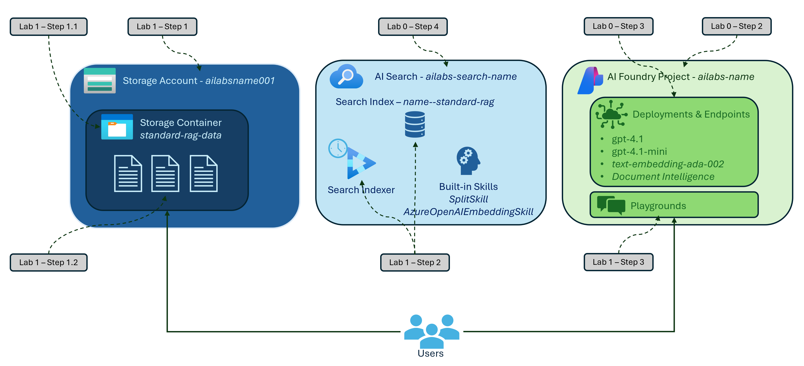

# Labs for Azure AI Search and RAG

## [Preparatory Lab](./Lab%200%20-%20Lab%20Setup.md)

In this Lab, you will set up your environment and prepare the necessary resources for the subsequent labs.

## [Lab 1 - Standard RAG](./Lab%201%20-%20Standard%20RAG.md)

In this lab, you will learn how to use Azure AI Search with Retrieval-Augmented Generation (RAG) to enhance search capabilities.

## [Lab 2 - Advanced RAG with Image Processing](./Lab%202%20-%20Image%20Processing%20RAG.md)

In this lab, you will extend the capabilities of Azure AI Search with RAG by integrating it with the Semantic Kernel, enabling more advanced search and retrieval functionalities.

## [Lab 3 - Graph RAG](./Lab%203%20-%20Graph%20RAG%20(Optional).md)

In this lab, you will orchestrate multiple agents using the Semantic Kernel to enhance the search experience with Azure AI Search and RAG.
