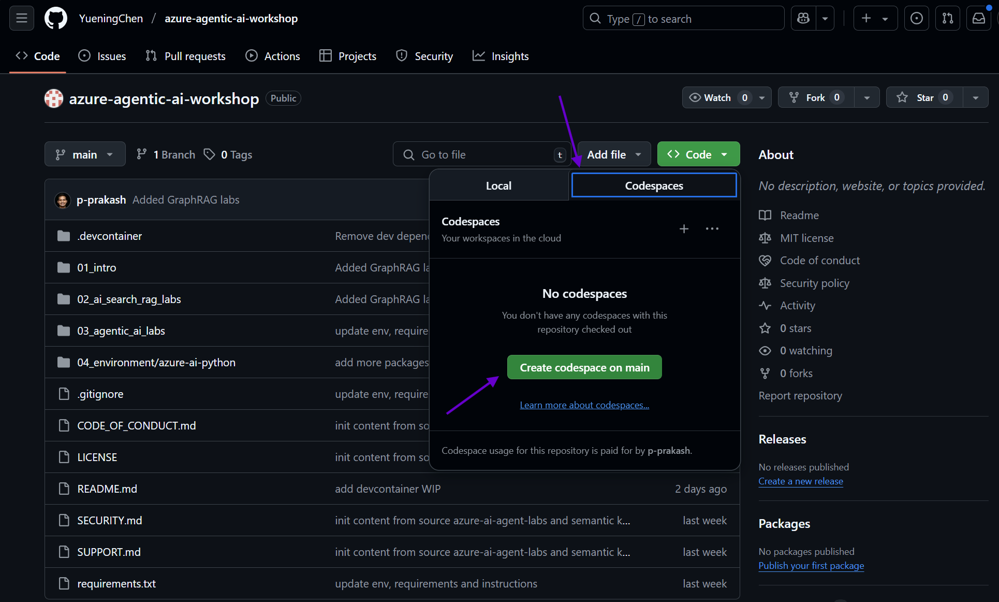

# Azure Agentic AI Workshop

Welcome to the **Azure Agentic AI Workshop** — a hands-on, structured learning experience designed to help business and technical participants explore and build solutions using Azure's Agent AI capabilities.

## Workshop Goals

This workshop is designed to:

- Introduce participants to the core concepts of Agentic AI
- Demonstrate how to build intelligent agents using Azure AI Foundry, Azure AI Search, and Semantic Kernel
- Provide hands-on labs and guided exercises to reinforce learning
- Enable participants to prototype real-world use cases

## Intended Audience

This workshop is ideal for:

- **Technical professionals** (developers, architects, data scientists) interested in building intelligent, context-aware agents using Azure
- **Business stakeholders** looking to understand the potential of Agent AI in their domain

## Key Technologies

| Technology         | Description                                                                 |
|--------------------|-----------------------------------------------------------------------------|
| **Azure AI Foundry** | Framework for building, evaluating, and deploying AI agents at scale      |
| **Azure AI Search**  | Enterprise-grade search engine to ground agents with contextual knowledge |
| **Semantic Kernel**  | SDK for orchestrating AI plugins, memory, and planning in .NET or Python  |

## Hands-On Labs

### Day 1 Lab details


### Day 2 Lab details


### [Agentic AI Labs PDF link](./agentic_ai_labs.pdf)

## Setup Instructions

### Prerequisites

- An Azure subscription :
  - Ensure that the individual creating the account and project has the Azure AI Account Owner role or Owner role at the subscription scope
  - The same individual must also have permissions to assign roles to required resources (Azure AI Search, Azure Blob Storage).
- Team should have access to the services/tools:
  - Azure CLI
  - Azure OpenAI Service
  - Azure AI Foundry
  - Azure AI Search
  - Storage Accounts
  - Install Semantic Kernel
  - VS Code .NET or Python environment
  - Azure Functions
  - Azure Logic Apps
  - Azure Document Intelligence
  - Azure Content Understanding
  - Azure AI Vision

### Clone the Repository

```bash
git clone https://github.com/YueningChen/azure-agentic-ai-workshop.git
cd azure-agentic-ai-workshop
```

### Environment Setup (.devcontainer)

1. Open the repository in Visual Studio Code in a new window.
2. If prompted, click on "Reopen in Container" to set up the development environment
3. If you don't see the prompt, open the Command Palette `Shift` + `Command` + `P` (Mac) or `Ctrl` + `Shift` + `P` (Windows) and select "Dev Containers: Reopen in Container".
4. Wait for the container to build and start. This may take a few minutes.

### Environment Setup (GitHub Codespaces)

1. Login to your personal GitHub account.
2. Open the repository ([YueningChen/azure-agentic-ai-workshop](https://github.com/YueningChen/azure-agentic-ai-workshop)) in your browser.
3. Choose the dropdown next to the green "Code" button and select "Codespaces", in the Codespaces tab choose **Create codespace on main**.
   
4. Wait for the Codespace to build and start. This may take a few minutes.

### Environment Setup (Local)

#### Pre-requisites

- #### Install Visual Studio Code (required if running locally)

   Download and install VS Code from: <https://code.visualstudio.com/>

- #### Install Python (required if running locally)

   Download and install Python (version 3.10 or higher) from: <https://www.python.org/downloads/>. During installation, check the box to "Add Python to PATH".

- #### Install the Azure CLI (required if running locally)

   Download and install the Azure CLI from: <https://learn.microsoft.com/cli/azure/install-azure-cli>. After installation, open a new terminal and run az --version to verify installation.

- #### Install Git (required if running locally)

   Download and install Git from: <https://git-scm.com/downloads>
   Follow the installation instructions for your operating system (Windows, macOS, or Linux).
   After installation, open a new terminal or command prompt and run git --version to verify Git is installed correctly.

#### 1. Create a Python virtual environment

```bash
python -m venv .venv
source .venv/bin/activate  # or .venv\Scripts\activate on Windows
```

#### 2. Install dependencies

```bash
pip install --upgrade pip
pip install -r requirements.txt
pip install graphrag
```

## Workshop Structure

```markdown
📦 azure-agentic-ai-workshop/
├── 01_intro/               # Introduction to Agentic AI Workshop and presentations
├── 02_ai_search_rag_labs/  # Labs for Azure RAG + AI Search
├── 03_agentic_ai_labs/     # Labs for Azure AI agent Services and Semantic Kernel Agent framework
├── requirements.txt
├── sample.env
└── README.md
```

## Workshop Agenda

|Topic | Duration|
|-----|-------|
|Welcome & Overview |15 minutes |
|Introduction to Agentic AI systems | 30 minutes |
|AI Agents design patterns | 30 minutes |
|Multi-Agents orchestration with Semantic Kernel | 30 minutes |
|GenAIOps | 30 minutes |
|Hands-on labs | 150 minutes |

## Resources

- <https://learn.microsoft.com/en-us/azure/ai-foundry/agents/overview>
- <https://learn.microsoft.com/en-us/semantic-kernel/frameworks/agent/?pivots=programming-language-python>
- <https://github.com/Azure/azure-ai-agents-labs>

## Feedback & Contributions

We welcome feedback and contributions! Please open an issue or submit a pull request
